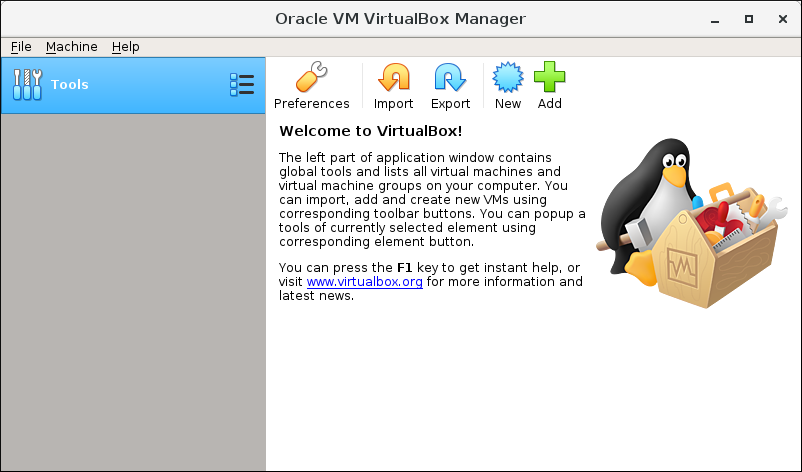

# ROS 
is an open-source meta robotics operating system. 
With it you can easily simulate your robot before developing it in the real world. 

##### For downloading ROS (Robot Operating System) on your operating system you will go through 3 steps. 

### 1 - Download the Oracle Virtualbox: 
You are going to use a virtual host to download Ubuntu and ROS and their packages, so you need Virtualbox; you can download it from this link: https://www.virtualbox.org/wiki/Downloads 

This is the VirtualBox homepage when the installation is done: 

### 2 - Download Ubuntu on VirtualBox: 
After installing many versions of Ubuntu, the best version that worked & installed successfully with me is Ubuntu 20.04. So, I recommend downloading this version. For the installation instructions follow the steps in the below video. 
https://www.youtube.com/watch?v=x5MhydijWmc&t=973s 

📌 Put in mind that inatalling ROS and Ubuntu may take long time upto 2 hours. 

When this process is done, you will see that you can't maximize the window & Can't copy/paste. 
To fix this problem you will need to download the GuestAddition, to do that, follow the following steps: 
- From the upper toolbox on the Ubuntu window choose Devices then Insert Guest Additions CD image... 

 

- Choose Run GuestAddition 

- Wait until the installation is done; log out or close the window and you will see that the GuestAddition is added. 

### 3 - Download ROS and Gazebo: 
You may follow the steps in this article: https://varhowto.com/install-ros-noetic-ubuntu-20-04/ or copy the commands directly: 

- 1 -  echo "deb http://packages.ros.org/ros/ubuntu focal main" | sudo tee /etc/apt/sources.list.d/ros-focal.list 
- 2 - sudo apt-key adv --keyserver 'hkp://keyserver.ubuntu.com:80' --recv-key C1CF6E31E6BADE8868B172B4F42ED6FBAB17C654 
- 3 - sudo apt update 
- 4 - sudo apt install ros-noetic-desktop-full (this package is heavy so you might need to free up some space. 
- 5 - echo "source /opt/ros/noetic/setup.bash" >> ~/.bashrc 
- 6 - tail ~/.bashrc 
- 7 - to verify the installation you can run: roscd, or roscore, and you can see the directory is changed like this: 

Finally, you can find Gazebo in the files/programs. 

Now you are done!
Have fun making you robot real :clap:

Notes: In case you want to install Gazebo, make sure to download the ros-noetic-desktop-full package. gazebo which is a user-interface software simulator including libraries and cloud services. 
